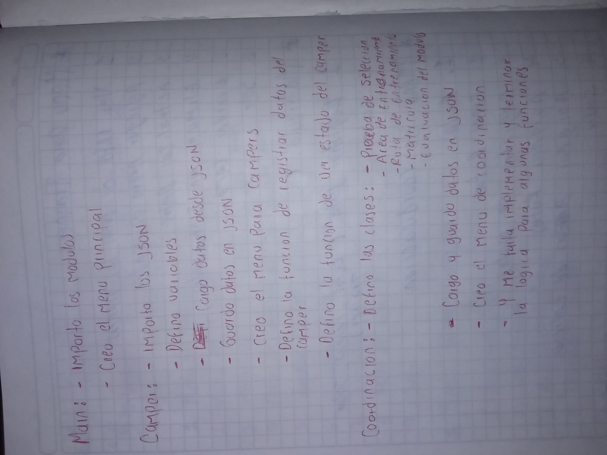

Estructura del proyecto:
El proyecto se organiza en un menú principal que contiene opciones para administrar campers, entrenadores, matrículas, coordinación, asignación de rutas y áreas de entrenamiento, filtros e informes. Cada uno de estos menús secundarios se encarga de una funcionalidad específica, como el registro y actualización de campers, entrenadores y áreas de entrenamiento, consulta de matrículas, asignación de rutas y áreas, generación de informes, entre otros.

Registro de Campers: Se implementa un módulo dedicado al registro de campers, donde se recopila la información necesaria para el seguimiento académico de cada camper, como su número de identificación, nombre, apellidos, dirección, acudiente, teléfonos de contacto y estado.

Registro de Trainer: Similar al registro de campers, se proporciona un módulo para registrar a los entrenadores expertos encargados de dirigir las diferentes rutas de entrenamiento. Se recopila información como el nombre, apellidos, identificación y horario.

Gestión de Rutas de Entrenamiento: Se crea un módulo específico para administrar las rutas de entrenamiento disponibles en CampusLands. Se pueden listar las rutas existentes, crear nuevas rutas y asignar campers y trainers a las rutas.

Registro de Pruebas y Evaluaciones: Se incorpora un módulo para registrar las notas de las pruebas teóricas y prácticas de los campers. Se calcula el promedio de las notas y se determina si el camper ha aprobado la prueba según un puntaje mínimo establecido.

Gestión de Matrículas: Se implementa un módulo para gestionar las matrículas de los campers aprobados en las diferentes rutas de entrenamiento. Se registran datos como el camper, entrenador asignado, ruta de entrenamiento, fechas de inicio y finalización, y salón de entrenamiento.

Generación de Reportes: Se crea un módulo de reportes que permite obtener información detallada sobre los campers y entrenadores, como la lista de campers inscritos, campers que aprobaron el examen inicial, entrenadores trabajando en CampusLands y campers con bajo rendimiento, entre otros.

Menú Principal y Navegación: Se diseña un menú principal que organiza todas las funcionalidades del sistema en diferentes opciones. Cada opción del menú principal corresponde a un módulo específico del sistema, lo que facilita la navegación y el acceso a las diferentes funcionalidades.

Análisis de la implementación:

Se utilizan funciones para modularizar el código y facilitar su mantenimiento.
Se implementan mecanismos de manejo de excepciones para gestionar posibles errores durante la carga y manipulación de archivos JSON.
Se definen funciones específicas para realizar acciones como listar rutas de entrenamiento, asignar campers a rutas, registrar notas de pruebas, consultar matrículas, generar informes, entre otras.
El programa sigue un flujo lógico que refleja los pasos requeridos para llevar a cabo las diferentes operaciones necesarias para la gestión académica de los campers en el programa intensivo de programación.

Conclusiones:
El proyecto aborda de manera integral los requerimientos establecidos por el departamento académico de CampusLands para llevar a cabo el seguimiento académico de los campers en el programa intensivo de programación. La estructura del proyecto está diseñada de manera clara y organizada, lo que facilita su comprensión y mantenimiento. Además, la implementación de funciones modulares y el manejo de excepciones contribuyen a la robustez y fiabilidad del programa.

